# Data Model & Entity Relationships

이 문서는 arbitrage-bot 서버에서 사용하는 주요 데이터 구조와 그 관계를 설명합니다.

## ERD (Entity Relationship Diagram)

```mermaid
erDiagram
    %% ===== CORE DOMAIN ENTITIES =====

    Chain {
        u8 id PK
        string name "Ethereum|Arbitrum|Solana|..."
    }

    Exchange {
        u16 id PK
        string name "Binance|Coinbase|Upbit|..."
        ExchangeType type "Cex|CpmmDex|ClmmDex|PerpDex"
    }

    QuoteCurrency {
        u8 id PK
        string name "USD|USDT|USDC|KRW"
    }

    Asset {
        string symbol PK "ETH|BTC|USDT"
        u8 chain_id FK
        u8 decimals "18|6|8"
        bytes32 contract_address "Optional"
    }

    TradingPair {
        u32 pair_id PK
        string base_symbol FK
        string quote_symbol FK
        u16 exchange_id FK
        bytes32 pool_address "DEX pool address"
    }

    %% ===== PRICE DATA =====

    PriceTick {
        u16 exchange_id FK
        u32 pair_id FK
        u8 quote_currency "USD|USDT|USDC|KRW"
        u64 price "FixedPoint 8 decimals"
        u64 bid "Best bid"
        u64 ask "Best ask"
        u64 bid_size "Orderbook depth"
        u64 ask_size "Orderbook depth"
        u64 volume_24h
        u64 liquidity
        u64 timestamp_ms
    }

    OrderbookSnapshot {
        u16 exchange_id FK
        u32 pair_id FK
        u64 timestamp_ms
        array bids "(price, qty)[]"
        array asks "(price, qty)[]"
    }

    %% ===== ARBITRAGE DETECTION =====

    PremiumMatrix {
        u32 pair_id FK
        hashmap prices "exchange -> (price, ts)"
    }

    ExchangePairPremium {
        u16 buy_exchange_id FK
        u16 sell_exchange_id FK
        u64 buy_price
        u64 sell_price
        i32 premium_bps "basis points"
        i32 net_profit_bps
    }

    ArbitrageOpportunity {
        u64 id PK
        u64 discovered_at_ms
        u64 expires_at_ms
        u16 source_exchange_id FK
        u16 target_exchange_id FK
        u8 source_quote FK "QuoteCurrency"
        u8 target_quote FK "QuoteCurrency"
        string asset_symbol FK
        u64 source_price
        u64 target_price
        u64 source_depth "Ask size at source"
        u64 target_depth "Bid size at target"
        i32 premium_bps "Raw premium"
        i32 kimchi_premium_bps "Via USD/KRW rate"
        i32 tether_premium_bps "Via USDT/KRW rate"
        u64 estimated_gas_cost
        u64 estimated_bridge_fee
        u64 estimated_trading_fee
        i64 net_profit_estimate
        u64 min_amount
        u64 max_amount
        u8 confidence_score "0-100"
    }

    %% ===== ROUTE & EXECUTION =====

    RouteStep {
        u8 step_index
        enum step_type "Trade|Bridge|Withdraw|Deposit"
        u16 exchange_id FK
        u32 pair_id FK
        enum side "Buy|Sell"
        u64 expected_price
        u16 slippage_bps
        u8 source_chain FK
        u8 dest_chain FK
        u8 bridge_protocol FK
    }

    BridgeProtocol {
        u8 id PK
        string name "LayerZero|Wormhole|Stargate|..."
    }

    BridgeRoute {
        u8 protocol_id FK
        u8 source_chain_id FK
        u8 dest_chain_id FK
        array supported_assets
        u16 fee_bps
        u32 estimated_time_secs
        u64 liquidity
        bool is_active
    }

    Order {
        u64 id PK
        string exchange_order_id
        u16 exchange_id FK
        u32 pair_id FK
        enum side "Buy|Sell"
        enum order_type "Market|Limit|IOC|FOK"
        u64 quantity
        u64 price
        u64 filled_quantity
        u64 avg_fill_price
        enum status "Pending|Submitted|Filled|..."
        u16 max_slippage_bps
        u64 created_at_ms
        u64 updated_at_ms
        string error_message
    }

    OrderFill {
        u64 order_id FK
        u64 quantity
        u64 price
        u64 timestamp_ms
        string trade_id
        u64 fee
        string fee_asset
    }

    ExecutionState {
        u64 opportunity_id FK
        enum status "Pending|Submitted|Filled|..."
        u8 current_step
        i64 realized_pnl
        string error_message
        u64 started_at_ms
        u64 completed_at_ms
    }

    ExecutedStep {
        u64 execution_id FK
        u8 step_index
        string description
        u64 timestamp_ms
        string tx_hash
    }

    ExecutionResult {
        u64 opportunity_id FK
        i64 realized_pnl
        u64 total_fees
        u64 started_at_ms
        u64 completed_at_ms
        bool success
        string error
    }

    ExecutionConfig {
        enum mode "Auto|ManualApproval|AlertOnly"
        u64 max_position_usd
        u16 max_slippage_bps
        i32 min_profit_bps
        u64 auto_execute_below_usd
    }

    %% ===== FEEDS / WEBSOCKET =====

    FeedConfig {
        string ws_url
        u16 exchange_id FK
        u64 reconnect_delay_ms
        u32 max_reconnect_attempts
        u64 ping_interval_ms
        u64 connect_timeout_ms
    }

    PriceAggregator {
        dashmap prices "thread-safe map"
    }

    %% ===== ALERTS =====

    AlertConfig {
        i64 id PK
        string telegram_chat_id
        i32 min_premium_bps "Alert threshold"
        array symbols "Whitelist (empty=all)"
        array excluded_symbols "Blacklist"
        array exchanges "Filter by exchange"
        bool enabled
    }

    AlertHistory {
        i64 id PK
        string symbol
        string source_exchange
        string target_exchange
        i32 premium_bps
        f64 source_price
        f64 target_price
        datetime created_at
    }

    ActiveOpportunity {
        i64 id PK
        string symbol
        string source_exchange
        string target_exchange
        i32 last_premium_bps
        datetime first_seen_at
        datetime last_seen_at
    }

    %% ===== RELATIONSHIPS =====

    Chain ||--o{ Asset : "hosts"
    Asset ||--o{ TradingPair : "base"
    Asset ||--o{ TradingPair : "quote"
    Exchange ||--o{ TradingPair : "lists"

    TradingPair ||--o{ PriceTick : "generates"
    TradingPair ||--o{ OrderbookSnapshot : "has"
    Exchange ||--o{ PriceTick : "publishes"
    QuoteCurrency ||--o{ PriceTick : "denominated in"

    TradingPair ||--|| PremiumMatrix : "tracked by"
    PremiumMatrix ||--o{ ExchangePairPremium : "calculates"

    Exchange ||--o{ ArbitrageOpportunity : "source"
    Exchange ||--o{ ArbitrageOpportunity : "target"
    Asset ||--o{ ArbitrageOpportunity : "involves"
    QuoteCurrency ||--o{ ArbitrageOpportunity : "source quote"
    QuoteCurrency ||--o{ ArbitrageOpportunity : "target quote"

    ArbitrageOpportunity ||--o{ RouteStep : "has route"
    Exchange ||--o{ RouteStep : "executes on"
    BridgeProtocol ||--o{ RouteStep : "uses"
    Chain ||--o{ RouteStep : "source/dest"

    BridgeProtocol ||--o{ BridgeRoute : "defines"
    Chain ||--o{ BridgeRoute : "connects"

    ArbitrageOpportunity ||--|| ExecutionState : "tracked by"
    ExecutionState ||--o{ ExecutedStep : "contains"
    ArbitrageOpportunity ||--|| ExecutionResult : "produces"
    ExecutionResult ||--o{ Order : "contains"

    TradingPair ||--o{ Order : "traded on"
    Exchange ||--o{ Order : "executed on"
    Order ||--o{ OrderFill : "filled by"

    Exchange ||--|| FeedConfig : "configured by"
    FeedConfig ||--|| PriceAggregator : "feeds into"

    AlertConfig ||--o{ AlertHistory : "generates"
    ArbitrageOpportunity ||--o{ ActiveOpportunity : "tracked as"
```



## 레이어별 구조체 요약

| 레이어 | 주요 구조체 | 역할 |
|--------|-------------|------|
| **Core** | `Asset`, `TradingPair`, `Exchange`, `Chain`, `QuoteCurrency` | 도메인 기본 엔티티 |
| **Feeds** | `FeedConfig`, `PriceTick`, `PriceAggregator`, `*Adapter`, `*Message` | 거래소 WebSocket → 실시간 가격 수집 |
| **Engine** | `PremiumMatrix`, `ArbitrageOpportunity`, `RouteStep`, `OpportunityDetector` | 프리미엄 계산 & 차익거래 기회 탐지 |
| **Executor** | `Order`, `OrderFill`, `ExecutionState`, `ExecutionResult` | 주문 실행 & 상태 추적 |
| **Alerts** | `AlertConfig`, `AlertHistory`, `TelegramBot`, `Notifier` | 텔레그램 알림 & 사용자 설정 |
| **Server** | `SharedState`, `DenominatedPrices`, `ExchangeStablecoinPrices` | 상태 관리 & 가격 정규화 |

## 핵심 데이터 흐름

```
Exchange WebSocket → PriceTick → PriceAggregator → PremiumMatrix
    → ArbitrageOpportunity → RouteStep[] → Order[] → ExecutionResult
```

---

## 상세 필드 설명

### Core 도메인

#### Chain (블록체인 네트워크)
| ID | 이름 |
|----|------|
| 1-7 | EVM: Ethereum, Arbitrum, Optimism, Base, Polygon, Avalanche, BSC |
| 10 | Solana |
| 20-21 | Cosmos: Cosmos, Osmosis |

#### Exchange (거래소)
| ID 범위 | 유형 | 예시 |
|---------|------|------|
| 100-107 | CEX | Binance, Coinbase, Kraken, OKX, Bybit, Upbit, Bithumb, GateIO |
| 200-202 | DEX CPMM | UniswapV2, SushiSwap |
| 201-204 | DEX CLMM | UniswapV3, Curve, Balancer |
| 300-302 | DEX Solana | Raydium, Orca, Jupiter |
| 400-402 | PerpDEX | dYdX, GMX, Hyperliquid |

#### QuoteCurrency (호가 통화)
| ID | 통화 | 설명 |
|----|------|------|
| 1 | USD | US Dollar (Coinbase) |
| 2 | USDT | Tether (Binance, Bybit, GateIO) |
| 3 | USDC | USD Coin |
| 4 | BUSD | Binance USD (legacy) |
| 10 | KRW | Korean Won (Upbit, Bithumb) |

#### Asset (자산)
```rust
Asset {
    symbol: CompactString,      // "ETH", "BTC", "USDT"
    chain: Chain,               // 어느 블록체인에 존재하는지
    decimals: u8,               // 소수점 자릿수 (ETH=18, USDT=6)
    contract_address: Option<[u8; 32]>,  // 토큰 컨트랙트 (네이티브는 None)
}
```

#### TradingPair (거래쌍)
```rust
TradingPair {
    base: Asset,                // 기준 자산 (ETH/USDT의 ETH)
    quote: Asset,               // 호가 자산 (ETH/USDT의 USDT)
    exchange: Exchange,         // 거래소
    pool_address: Option<[u8; 32]>,  // DEX 풀 주소
}
```

---

### Price 데이터

#### PriceTick (실시간 가격, 71 bytes packed)
```rust
PriceTick {
    exchange: Exchange,         // 2 bytes
    pair_id: u32,               // 4 bytes
    quote_currency: u8,         // 1 byte (USD, USDT, USDC, KRW)
    price: u64,                 // 8 bytes, FixedPoint (8 decimals)
    bid: u64,                   // 8 bytes, 최우선 매수호가
    ask: u64,                   // 8 bytes, 최우선 매도호가
    bid_size: u64,              // 8 bytes, 매수 호가창 깊이
    ask_size: u64,              // 8 bytes, 매도 호가창 깊이
    volume_24h: u64,            // 8 bytes
    liquidity: u64,             // 8 bytes
    timestamp_ms: u64,          // 8 bytes
}
```

#### OrderbookSnapshot (호가창)
```rust
OrderbookSnapshot {
    exchange: Exchange,
    pair_id: u32,
    timestamp_ms: u64,
    bids: Vec<(u64, u64)>,      // (가격, 수량), 내림차순
    asks: Vec<(u64, u64)>,      // (가격, 수량), 오름차순
}
```

---

### Arbitrage 탐지

#### ArbitrageOpportunity (차익거래 기회)
```rust
ArbitrageOpportunity {
    id: u64,
    discovered_at_ms: u64,
    expires_at_ms: u64,         // 기본 30초

    // 가격 정보
    source_exchange: Exchange,  // 싸게 사는 거래소
    target_exchange: Exchange,  // 비싸게 파는 거래소
    source_quote: QuoteCurrency, // 매수 거래소 호가 통화
    target_quote: QuoteCurrency, // 매도 거래소 호가 통화
    asset: Asset,
    source_price: u64,
    target_price: u64,
    source_depth: u64,          // 매수 호가창 깊이 (ask size)
    target_depth: u64,          // 매도 호가창 깊이 (bid size)

    // 프리미엄 (basis points)
    premium_bps: i32,           // 직접 가격 비교
    kimchi_premium_bps: i32,    // USD/KRW 환율 기준
    tether_premium_bps: i32,    // USDT/KRW 기준

    // 경로
    route: Vec<RouteStep>,
    total_hops: u8,

    // 비용
    estimated_gas_cost: u64,
    estimated_bridge_fee: u64,
    estimated_trading_fee: u64,

    // 실행
    net_profit_estimate: i64,
    min_amount: u64,
    max_amount: u64,
    confidence_score: u8,       // 0-100
}
```

#### RouteStep (경로 단계)
```rust
enum RouteStep {
    Trade {
        exchange: Exchange,
        pair_id: u32,
        side: TradeSide,        // Buy | Sell
        expected_price: u64,
        slippage_bps: u16,
    },
    Bridge {
        protocol: BridgeProtocol,
        source_chain: Chain,
        dest_chain: Chain,
    },
    Withdraw { exchange: Exchange, chain: Chain },
    Deposit { exchange: Exchange, chain: Chain },
}
```

---

### 실행 (Executor)

#### Order (주문)
```rust
Order {
    id: u64,
    exchange_order_id: Option<String>,
    exchange: Exchange,
    pair_id: u32,
    side: TradeSide,            // Buy | Sell
    order_type: OrderType,      // Market | Limit | IOC | FOK
    quantity: u64,
    price: u64,
    filled_quantity: u64,
    avg_fill_price: u64,
    status: OrderStatus,        // Pending | Submitted | PartiallyFilled | Filled | Cancelled | Failed
    max_slippage_bps: u16,
    created_at_ms: u64,
    updated_at_ms: u64,
    error_message: Option<String>,
}
```

#### ExecutionResult (실행 결과)
```rust
ExecutionResult {
    opportunity_id: u64,
    orders: Vec<Order>,
    realized_pnl: i64,          // 실현 손익
    total_fees: u64,
    started_at_ms: u64,
    completed_at_ms: Option<u64>,
    success: bool,
    error: Option<String>,
}
```

---

### Feeds (WebSocket)

#### FeedConfig (피드 설정)
```rust
FeedConfig {
    ws_url: String,
    exchange: Exchange,
    reconnect_delay_ms: u64,    // 기본 1000
    max_reconnect_attempts: u32, // 기본 10
    ping_interval_ms: u64,      // 기본 30000
    connect_timeout_ms: u64,    // 기본 10000
}
```

#### 거래소별 WebSocket 메시지 포맷

| 거래소 | 메시지 타입 | 주요 필드 |
|--------|------------|-----------|
| **Binance** | ticker, depth | symbol, close, bid, ask, volume, event_time |
| **Coinbase** | l2_data (snapshot/update) | product_id, bids, offers, time |
| **Bybit** | tickers | symbol, lastPrice, bid1Price, ask1Price |
| **GateIO** | spot.tickers | currency_pair, last, highest_bid, lowest_ask |
| **Upbit** | ticker, orderbook | code, trade_price, orderbook_units |
| **Bithumb** | ticker, orderbookdepth | symbol, closePrice, orderbook |

#### Adapter 메시지 구조

```rust
// Upbit/Bithumb 통합 메시지 파서
pub enum UpbitMessage {
    Ticker { code: String, price: FixedPoint },
    Orderbook { code: String, bid: FixedPoint, ask: FixedPoint, bid_size: FixedPoint, ask_size: FixedPoint },
}

pub enum BithumbMessage {
    Ticker { symbol: String, price: FixedPoint },
    Orderbook { symbol: String, bid: FixedPoint, ask: FixedPoint, bid_size: FixedPoint, ask_size: FixedPoint },
}

// Coinbase L2 이벤트
pub enum CoinbaseL2Event {
    Snapshot { product_id: String, bids: Vec<(f64, f64)>, asks: Vec<(f64, f64)> },
    Update { product_id: String, bids: Vec<(f64, f64)>, asks: Vec<(f64, f64)> },
}
```

---

## Price Normalization

### DenominatedPrices (가격 정규화 구조체)

모든 가격은 세 가지 형태로 저장됩니다:

```rust
pub struct DenominatedPrices {
    pub raw: FixedPoint,      // 원본 가격 (거래소 호가 통화)
    pub usd: FixedPoint,      // USD 정규화 가격
    pub usdlike: FixedPoint,  // USDT/USDC 환산 가격
}
```

| Field | Description | Example |
|-------|-------------|---------|
| `raw` | 원본 거래소 가격 | Binance: 34,800 USDT |
| `usd` | USD 정규화 가격 | 34,730.40 USD (USDT=0.998) |
| `usdlike` | USDT/USDC 환산 가격 | 34,800 USDT |

### ExchangeStablecoinPrices (거래소별 스테이블코인 환율)

각 거래소의 USDT/USD, USDC/USD 환율을 추적합니다:

```rust
pub struct ExchangeStablecoinPrices {
    pub exchange: Exchange,
    pub usdt_usd: f64,   // e.g., 0.998
    pub usdc_usd: f64,   // e.g., 1.001
    pub timestamp: u64,
}
```

### 가격 변환 흐름

| 거래소 | 원본 Quote | 변환 방식 |
|--------|-----------|----------|
| **Binance** | USDT/USDC | raw × (stablecoin/USD rate) → usd |
| **Bybit** | USDT/USDC | raw × (stablecoin/USD rate) → usd |
| **GateIO** | USDT/USDC | raw × (stablecoin/USD rate) → usd |
| **Coinbase** | USD/USDT/USDC | USD/USDC는 그대로, USDT × rate |
| **Upbit** | KRW | raw ÷ (USDT/KRW rate) → usdlike → usd |
| **Bithumb** | KRW | raw ÷ (USDT/KRW rate) → usdlike → usd |

## 타입 안전성

- 모든 가격은 `FixedPoint` (u64, 8 decimals) 사용 → 부동소수점 오차 방지
- Exchange/Chain/Bridge/QuoteCurrency ID는 compact repr (u8/u16) enum → 효율적 직렬화
- `PriceTick`은 71 bytes packed struct → 메모리 최적화
- `PriceAggregator`는 `DashMap` 사용 → 스레드 안전한 동시 업데이트
- 모든 가격은 `DenominatedPrices`로 저장 (raw, usd, usdlike 세 가지 형태)
- 스테이블코인 디페깅 시에도 정확한 USD 변환 보장

---

## JSON 표현 (Internal Data Structures)

백엔드 내부에서 사용되는 데이터 구조를 JSON 형태로 표현한 레퍼런스입니다.

### Enums (열거형)

#### Chain
```json
{
  "Ethereum": 1,
  "Arbitrum": 2,
  "Optimism": 3,
  "Base": 4,
  "Polygon": 5,
  "Avalanche": 6,
  "Bsc": 7,
  "Solana": 10,
  "Cosmos": 20,
  "Osmosis": 21
}
```

#### Exchange
```json
{
  "Binance": 100,
  "Coinbase": 101,
  "Kraken": 102,
  "Okx": 103,
  "Bybit": 104,
  "Upbit": 105,
  "Bithumb": 106,
  "GateIO": 107,
  "UniswapV2": 200,
  "UniswapV3": 201,
  "SushiSwap": 202,
  "Curve": 203,
  "Balancer": 204,
  "Raydium": 300,
  "Orca": 301,
  "Jupiter": 302,
  "Dydx": 400,
  "Gmx": 401,
  "Hyperliquid": 402
}
```

#### QuoteCurrency
```json
{
  "USD": 1,
  "USDT": 2,
  "USDC": 3,
  "BUSD": 4,
  "KRW": 10
}
```

#### BridgeProtocol
```json
{
  "Native": 0,
  "LayerZero": 1,
  "Wormhole": 2,
  "Stargate": 3,
  "Across": 4,
  "Hop": 5,
  "Synapse": 6,
  "Celer": 7,
  "Axelar": 8
}
```

#### TradeSide / ExecutionMode / OrderStatus
```json
// TradeSide
{ "Buy": 0, "Sell": 1 }

// ExecutionMode
{ "Auto": 0, "ManualApproval": 1, "AlertOnly": 2 }

// OrderStatus
{
  "Pending": 0,
  "Submitted": 1,
  "PartiallyFilled": 2,
  "Filled": 3,
  "Cancelled": 4,
  "Failed": 5
}
```

---

### Core Structs

#### Asset (자산)
```json
// 네이티브 자산
{
  "symbol": "ETH",
  "chain": "Ethereum",
  "decimals": 18,
  "contract_address": null
}

// 토큰
{
  "symbol": "USDT",
  "chain": "Ethereum",
  "decimals": 6,
  "contract_address": "0xdac17f958d2ee523a2206206994597c13d831ec7000000000000000000000000"
}
```

#### TradingPair (거래쌍)
```json
{
  "base": {
    "symbol": "ETH",
    "chain": "Ethereum",
    "decimals": 18,
    "contract_address": null
  },
  "quote": {
    "symbol": "USDT",
    "chain": "Ethereum",
    "decimals": 6,
    "contract_address": "0xdac17f..."
  },
  "exchange": "Binance",
  "pool_address": null
}
```

#### FixedPoint (고정소수점)
```json
// 8자리 정밀도: 50000.12345678 → 5000012345678
// Scale: 10^8 = 100,000,000
{ "value": 5000012345678 }
// 1.0 = 100000000
// 50000.5 = 5000050000000
```

---

### Price Data

#### PriceTick (가격 틱, 71 bytes packed)
```json
{
  "exchange": "Binance",
  "pair_id": 1,
  "quote_currency": "USDT",
  "price": 5000000000000,
  "bid": 4999900000000,
  "ask": 5000100000000,
  "bid_size": 150000000,
  "ask_size": 200000000,
  "volume_24h": 100000000000000,
  "liquidity": 50000000000000,
  "timestamp_ms": 1703721600000
}
```
> 모든 가격/금액 필드는 FixedPoint (×10^8)

#### OrderbookSnapshot (호가창)
```json
{
  "exchange": "Binance",
  "pair_id": 1,
  "timestamp_ms": 1703721600000,
  "bids": [
    [5000000000000, 1000000000],
    [4999000000000, 2000000000]
  ],
  "asks": [
    [5001000000000, 500000000],
    [5002000000000, 1500000000]
  ]
}
```

---

### Bridge

#### BridgeRoute
```json
{
  "protocol": "Stargate",
  "source_chain": "Ethereum",
  "dest_chain": "Arbitrum",
  "supported_assets": [
    { "symbol": "ETH", "chain": "Ethereum", "decimals": 18, "contract_address": null },
    { "symbol": "USDC", "chain": "Ethereum", "decimals": 6, "contract_address": "0xa0b8..." }
  ],
  "fee_bps": 50,
  "estimated_time_secs": 300,
  "liquidity": 100000000000000,
  "is_active": true
}
```

---

### Opportunity

#### RouteStep (경로 단계, Tagged Union)
```json
// Trade
{
  "Trade": {
    "exchange": "Binance",
    "pair_id": 1,
    "side": "Buy",
    "expected_price": 5000000000000,
    "slippage_bps": 10
  }
}

// Bridge
{
  "Bridge": {
    "protocol": "Stargate",
    "source_chain": "Ethereum",
    "dest_chain": "Arbitrum"
  }
}

// Withdraw
{ "Withdraw": { "exchange": "Binance", "chain": "Ethereum" } }

// Deposit
{ "Deposit": { "exchange": "Upbit", "chain": "Ethereum" } }
```

#### ExchangePairPremium (거래소 간 프리미엄)
```json
{
  "buy_exchange": "Binance",
  "sell_exchange": "Upbit",
  "buy_price": 5000000000000,
  "sell_price": 5075000000000,
  "premium_bps": 150,
  "net_profit_bps": 120
}
```

#### ArbitrageOpportunity (차익거래 기회)
```json
{
  "id": 12345,
  "discovered_at_ms": 1703721600000,
  "expires_at_ms": 1703721630000,

  "source_exchange": "Binance",
  "target_exchange": "Upbit",
  "source_quote": "USDT",
  "target_quote": "KRW",
  "asset": {
    "symbol": "ETH",
    "chain": "Ethereum",
    "decimals": 18,
    "contract_address": null
  },
  "source_price": 5000000000000,
  "target_price": 5075000000000,
  "source_depth": 150000000,
  "target_depth": 200000000,

  "premium_bps": 150,
  "kimchi_premium_bps": 145,
  "tether_premium_bps": 150,

  "route": [
    { "Trade": { "exchange": "Binance", "pair_id": 1, "side": "Buy", "expected_price": 5000000000000, "slippage_bps": 10 } },
    { "Withdraw": { "exchange": "Binance", "chain": "Ethereum" } },
    { "Deposit": { "exchange": "Upbit", "chain": "Ethereum" } },
    { "Trade": { "exchange": "Upbit", "pair_id": 1, "side": "Sell", "expected_price": 5075000000000, "slippage_bps": 10 } }
  ],
  "total_hops": 4,

  "estimated_gas_cost": 50000000,
  "estimated_bridge_fee": 0,
  "estimated_trading_fee": 20000000,
  "net_profit_estimate": 70000000,

  "min_amount": 10000000000,
  "max_amount": 1000000000000,
  "confidence_score": 85
}
```

---

### Execution

#### ExecutionConfig
```json
{
  "mode": "ManualApproval",
  "max_position_usd": 1000000000000,
  "max_slippage_bps": 50,
  "min_profit_bps": 30,
  "auto_execute_below_usd": 10000000000
}
```

#### ExecutedStep
```json
{
  "step_index": 0,
  "description": "Bought 1.5 ETH on Binance at 50000.0",
  "timestamp_ms": 1703721601000,
  "tx_hash": "0xabc123..."
}
```

#### ExecutionState
```json
{
  "opportunity_id": 12345,
  "status": "PartiallyFilled",
  "executed_steps": [
    {
      "step_index": 0,
      "description": "Bought 1.5 ETH on Binance",
      "timestamp_ms": 1703721601000,
      "tx_hash": "0xabc..."
    },
    {
      "step_index": 1,
      "description": "Withdrew ETH to wallet",
      "timestamp_ms": 1703721605000,
      "tx_hash": "0xdef..."
    }
  ],
  "current_step": 2,
  "realized_pnl": 0,
  "error_message": null,
  "started_at_ms": 1703721600000,
  "completed_at_ms": null
}
```

---

## WebSocket 통신 (Server ↔ Frontend)

서버와 프론트엔드는 **WebSocket + JSON** 형식으로 통신합니다.

### 메시지 포맷

모든 메시지는 `type`과 `data` 필드를 가진 tagged union 형태입니다.

#### Price (단일 가격 업데이트)
```json
{
  "type": "price",
  "data": {
    "exchange": "Binance",
    "symbol": "BTC",
    "pair_id": 1,
    "price": 50000.12345678,
    "bid": 49999.0,
    "ask": 50001.0,
    "timestamp": 1703721600000
  }
}
```

#### Prices (가격 배치, 초기 연결 시)
```json
{
  "type": "prices",
  "data": [
    {
      "exchange": "Binance",
      "symbol": "BTC",
      "pair_id": 1,
      "price": 50000.0,
      "bid": 49999.0,
      "ask": 50001.0,
      "timestamp": 1703721600000
    },
    {
      "exchange": "Coinbase",
      "symbol": "ETH",
      "pair_id": 2,
      "price": 2500.0,
      "bid": 2499.0,
      "ask": 2501.0,
      "timestamp": 1703721600000
    }
  ]
}
```

#### Stats (통계)
```json
{
  "type": "stats",
  "data": {
    "uptime_secs": 3600,
    "price_updates": 15000,
    "opportunities_detected": 42,
    "trades_executed": 5,
    "is_running": true
  }
}
```

#### Opportunity (차익거래 기회)
```json
{
  "type": "opportunity",
  "data": {
    "id": 12345,
    "source_exchange": "Binance",
    "target_exchange": "Upbit",
    "premium_bps": 150,
    "source_price": 50000.0,
    "target_price": 50750.0,
    "timestamp": 1703721600000
  }
}
```

#### Exchange Rate (환율)
```json
{
  "type": "exchange_rate",
  "data": {
    "usd_krw": 1320.50,
    "timestamp": 1703721600000
  }
}
```

### 내부 vs 외부 데이터 형식 비교

| 구분 | 내부 (Core) | 외부 (WebSocket) |
|------|-------------|------------------|
| 가격 | `u64` (FixedPoint ×10^8) | `f64` (소수점) |
| Exchange | `Exchange` enum (u16) | `String` ("Binance") |
| Timestamp | `u64` (ms) | `number` (ms) |
| 직렬화 | Binary (packed struct) | JSON |
| 용도 | 고성능 연산 | 프론트엔드 표시 |

### 크기 비교

| 구조체 | 내부 크기 | JSON 크기 (예상) |
|--------|----------|-----------------|
| `PriceTick` | 71 bytes | ~250 bytes |
| `ArbitrageOpportunity` | ~350 bytes | ~1.2KB |
| 1000개 PriceTick 배치 | ~71KB | ~250KB |