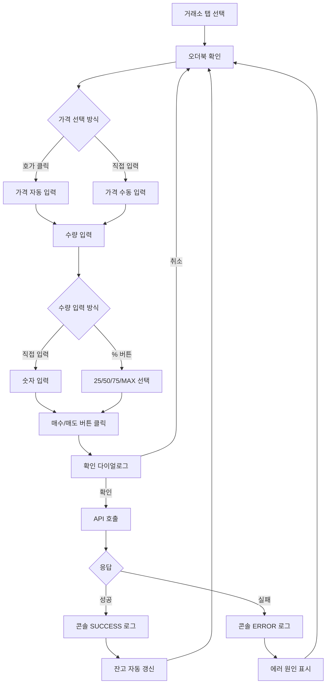
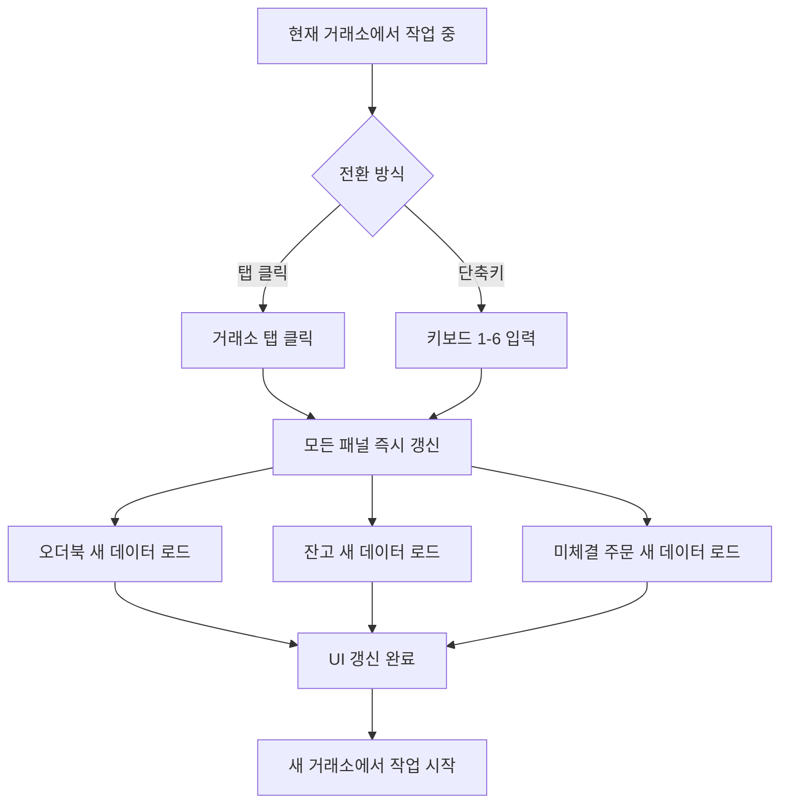
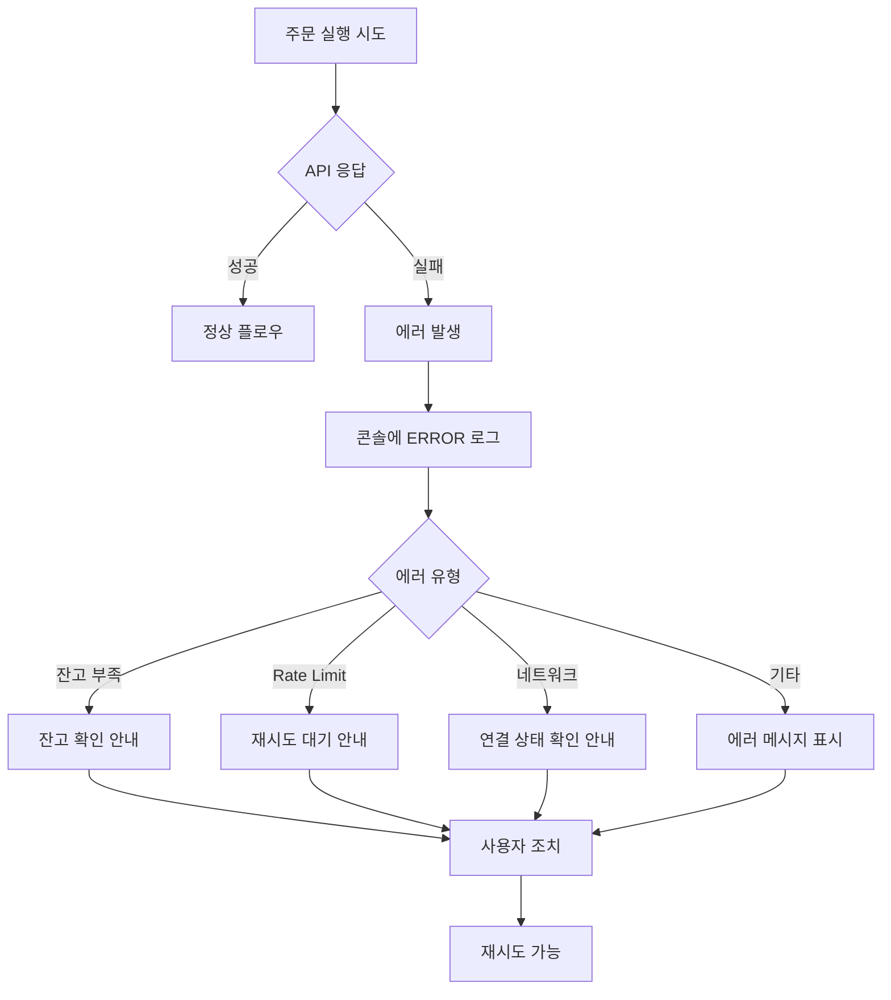

# UX Design Specification - arbitrage-bot

**Author:** Hyowon
**Date:** 2026-01-18

---

## Executive Summary

### Project Vision

**arbitrage-bot WTS**는 암호화폐 트레이더를 위한 블룸버그 터미널 스타일의 통합 트레이딩 시스템입니다. 기존 모니터링 앱(차익거래 탐지)과 **완전히 분리된 독립 창**으로 실행되며, 거래소 웹사이트 방문 없이 API를 통해 직접 거래를 실행합니다.

**핵심 가치:**
- 6개 거래소를 단일 창에서 통합 관리
- 거래소 프론트엔드 장애와 독립적으로 동작
- 실시간 거래 실행 (배치 처리 금지)

### Target Users

| 특성 | 설명 |
|------|------|
| **사용자 유형** | 개인 암호화폐 트레이더 |
| **기술 수준** | 고급 (API, 거래소 구조 이해) |
| **사용 환경** | 데스크톱 전체 화면 (macOS, Windows, Linux) |
| **사용 빈도** | 매일, 장시간 모니터링 |
| **주요 목적** | 신속한 거래 실행, 입출금 관리 |

### Key Design Challenges

1. **정보 밀도 vs 명료성**
   - 6개 패널을 전체 화면에 효과적으로 배치
   - 고밀도 정보를 빠르게 스캔 가능하도록 설계
   - 패널 크기/위치 조절 기능 필요

2. **실시간성과 피드백**
   - 오더북: WebSocket 메시지 수신 → UI 갱신 100ms 이내
   - 주문 실행: 버튼 클릭 즉시 API 호출 (배치 금지)
   - 사용자 액션 → 피드백 200ms 이내

3. **치명적 액션의 안전장치**
   - 출금/주문 전 확인 다이얼로그 필수
   - 속도를 해치지 않는 선에서 실수 방지

4. **거래소 간 컨텍스트 스위칭**
   - 현재 선택된 거래소 명확히 표시
   - 거래소 전환 시 모든 패널 즉시 반영
   - 잘못된 거래소에서 거래하는 실수 방지

5. **에러 가시성**
   - API 에러, Rate Limit, 네트워크 오류 즉시 표시
   - 콘솔에 타임스탬프와 함께 색상 구분
   - 원인 파악 및 재시도 가능

### Design Opportunities

1. **터미널 미학의 현대화**
   - 블룸버그 터미널의 효율성 + 현대적 UI
   - 다크 테마 기본 (트레이더 선호, 장시간 사용)
   - 고대비 색상으로 중요 정보 강조

2. **유연한 레이아웃 시스템**
   - 패널 크기/위치 조절 가능
   - 사용자 맞춤 레이아웃 저장
   - 전체 화면 최적화

3. **키보드 중심 워크플로우**
   - 파워 유저를 위한 단축키
   - 빠른 거래소 전환, 주문 실행

4. **상태의 즉각적 시각화**
   - 연결 상태 인디케이터
   - 거래 성공/실패 피드백
   - 잔고 변화 하이라이트

## Core User Experience

### Defining Experience

**핵심 사용자 루프:**

```
오더북 확인 → 주문 실행 → 결과 확인 → (반복)
```

이 루프가 WTS의 핵심 가치를 전달하는 가장 중요한 사용자 경험입니다. 모든 UX 결정은 이 루프를 최대한 빠르고 신뢰성 있게 만드는 방향으로 이루어져야 합니다.

**핵심 액션:**
- 가장 빈번한 액션: 주문 실행 (매수/매도)
- 가장 중요한 액션: 거래소 전환 후 즉각적인 컨텍스트 반영
- 가장 민감한 액션: 출금 실행

### Platform Strategy

| 항목 | 결정 |
|------|------|
| **플랫폼** | Tauri 데스크톱 앱 (macOS, Windows, Linux) |
| **화면 사용** | 전체 화면 최적화 |
| **입력 방식** | 마우스 + 키보드 (단축키 지원) |
| **오프라인 지원** | 미지원 (거래소 API 연결 필수) |
| **모니터링 앱 관계** | 완전히 분리된 독립 창 |
| **레이아웃** | 패널 크기/위치 조절 가능, 레이아웃 저장 |

### Effortless Interactions

**완전히 쉬워야 하는 것들:**

1. **거래소 전환**
   - 탭 클릭 한 번으로 모든 패널 즉시 갱신
   - 현재 거래소 명확히 표시
   - 키보드 단축키 지원 (1-6)

2. **주문 실행**
   - 수량/가격 입력 → 버튼 클릭 → 즉시 API 호출
   - 확인 다이얼로그는 간결하게
   - 결과 즉시 콘솔에 표시

3. **잔고 확인**
   - 한눈에 모든 자산 파악
   - 거래 완료 후 자동 갱신
   - 변화량 하이라이트

4. **에러 원인 파악**
   - 콘솔에서 즉시 확인
   - 색상 코드로 심각도 구분
   - 타임스탬프 포함

### Critical Success Moments

| 순간 | 설명 | 중요도 |
|------|------|--------|
| **첫 주문 성공** | WTS에서 첫 매수/매도 실행, 잔고 변화 확인 | 최고 |
| **거래소 웹 장애 중 거래** | 거래소 웹이 다운됐는데 WTS로 거래 가능 | 최고 |
| **빠른 컨텍스트 스위칭** | 탭 전환 후 바로 다른 거래소에서 거래 | 높음 |
| **출금 완료** | WTS에서 직접 출금, 콘솔에서 확인 | 높음 |
| **에러 후 복구** | 에러 원인 파악 후 성공적인 재시도 | 중간 |

### Experience Principles

| 원칙 | 설명 | 적용 |
|------|------|------|
| **즉각적 반응** | 모든 사용자 액션은 200ms 내 피드백 | 버튼, 탭, 입력 모두 |
| **명확한 컨텍스트** | 현재 거래소/마켓이 항상 명확히 표시 | 헤더, 패널 제목 |
| **안전한 실행** | 치명적 액션(주문/출금)은 확인 후 실행 | 다이얼로그 필수 |
| **에러 투명성** | 모든 에러는 즉시, 명확하게 표시 | 콘솔 로그 |
| **유연한 레이아웃** | 사용자가 패널 크기/위치 조절 가능 | 드래그 리사이즈 |

## Desired Emotional Response

### Primary Emotional Goals

| 순위 | 감정 | 설명 |
|------|------|------|
| 1 | **통제감 (In Control)** | "내가 시장을 직접 컨트롤하고 있다" |
| 2 | **신뢰감 (Trust)** | "이 시스템은 내가 원하는 대로 정확히 실행한다" |
| 3 | **효율성 (Efficiency)** | "거래소 웹보다 훨씬 빠르고 편하다" |
| 4 | **자신감 (Confidence)** | "거래소가 다운돼도 나는 거래할 수 있다" |

### Emotional Journey Mapping

| 단계 | 원하는 감정 | 디자인 함의 |
|------|------------|------------|
| **첫 실행** | 익숙함 + 기대감 | 블룸버그 터미널 스타일로 전문가 도구 느낌 |
| **거래소 선택** | 명확함 | 현재 거래소가 강조되어 혼란 없음 |
| **오더북 확인** | 집중 | 실시간 데이터가 부드럽게 갱신 |
| **주문 입력** | 신중함 | 입력값 검증, 명확한 버튼 |
| **확인 다이얼로그** | 안심 | 실수 방지, 빠른 확인 |
| **주문 실행** | 만족감 | 즉각적 피드백, 성공 표시 |
| **에러 발생** | 침착함 | 명확한 에러 메시지, 복구 방법 안내 |
| **출금 완료** | 안도감 | 성공 확인, 트랜잭션 추적 가능 |

### Micro-Emotions

**원하는 감정:**

| 감정 | 적용 상황 |
|------|----------|
| **확신 (Confidence)** | 주문 버튼 클릭 시 - "이게 맞아" |
| **신뢰 (Trust)** | API 응답 시 - "제대로 실행됐어" |
| **성취 (Accomplishment)** | 거래 완료 시 - "해냈다" |
| **안정 (Calm)** | 장시간 사용 시 - "편하게 모니터링할 수 있어" |

**피해야 할 감정:**

| 감정 | 원인 | 방지 방법 |
|------|------|----------|
| **혼란 (Confusion)** | 어떤 거래소인지 모름 | 거래소 강조 표시 |
| **불안 (Anxiety)** | 주문이 실행됐는지 모름 | 즉각적 피드백 |
| **좌절 (Frustration)** | 에러 원인 파악 불가 | 명확한 에러 메시지 |
| **공포 (Fear)** | 잘못된 출금 | 확인 다이얼로그 + 주소 검증 |

### Design Implications

| 원하는 감정 | UX 디자인 접근 |
|------------|---------------|
| **통제감** | 모든 액션에 즉각적 피드백, 배치 처리 없음 |
| **신뢰감** | 성공/실패 명확히 표시, 콘솔 로그 상세히 |
| **효율성** | 키보드 단축키, 빠른 거래소 전환 |
| **자신감** | 연결 상태 표시, 거래소 독립성 강조 |
| **침착함** | 다크 테마, 차분한 색상, 정보 과부하 방지 |

### Emotional Design Principles

1. **즉각성이 통제감을 만든다**
   - 모든 사용자 액션에 200ms 이내 피드백
   - 배치 처리 금지, 개별 요청 즉시 실행

2. **명확성이 신뢰를 만든다**
   - 성공/실패 상태 즉시 표시
   - 에러 메시지는 구체적이고 행동 가능하게

3. **일관성이 자신감을 만든다**
   - 모든 거래소에서 동일한 UX 패턴
   - 예측 가능한 인터랙션

4. **차분함이 집중을 만든다**
   - 다크 테마로 눈의 피로 감소
   - 필수 정보만 강조, 나머지는 차분하게

## UX Pattern Analysis & Inspiration

### Inspiring Products Analysis

**트레이딩 터미널:**

| 제품 | 강점 | 적용 가능 패턴 |
|------|------|---------------|
| **Bloomberg Terminal** | 정보 밀도, 키보드 중심 | 다중 패널, 다크 테마 |
| **TradingView** | 드래그 가능한 패널, 실시간 표시 | 패널 리사이즈, depth bar |
| **MetaTrader 4/5** | 원클릭 트레이딩, 업계 표준 | 원클릭 주문, 워치리스트 |
| **Interactive Brokers TWS** | 고밀도 정보, 커스터마이즈 | 레이아웃 저장, 핫키 |
| **thinkorswim** | 직관적 주문 입력 | 주문 폼 단순화 |

**거래소 웹:**

| 제품 | 강점 | 적용 가능 패턴 |
|------|------|---------------|
| **Binance Pro** | 익숙한 레이아웃 | 오더북 + 주문 폼 조합 |
| **Upbit** | 한국 거래소 표준 | KRW 표시 방식 |

**개발 도구:**

| 제품 | 강점 | 적용 가능 패턴 |
|------|------|---------------|
| **VS Code** | 패널 시스템, 콘솔 | 하단 콘솔 배치 |

### Transferable UX Patterns

**간단하고 직관적인 패턴 (채택):**

| 패턴 | 설명 | 적용 위치 |
|------|------|----------|
| **원클릭 거래소 전환** | 탭 하나로 모든 컨텍스트 변경 | 상단 탭 바 |
| **호가 터치 → 가격 입력** | 오더북에서 가격 선택하면 자동 입력 | 오더북 → 주문 폼 |
| **수량 % 버튼** | 25%, 50%, 75%, MAX 버튼 | 주문 폼 |
| **시장가/지정가 토글** | 단순 탭 전환 | 주문 폼 상단 |
| **색상 코딩** | 녹색=매수, 빨강=매도 (전통적) | 전체 UI |
| **상태 인디케이터** | 녹색 점=연결됨, 빨강 점=끊김 | 헤더 |
| **하단 콘솔** | VS Code 스타일 로그 | 하단 패널 |
| **확인 다이얼로그** | 주문/출금 전 필수 확인 | 모달 |

### Anti-Patterns to Avoid

**복잡한 패턴 (피해야 함):**

| 안티패턴 | 문제점 | 대안 |
|----------|--------|------|
| **다중 계층 메뉴** | 클릭 수 증가, 느린 접근 | 플랫 탭 구조 |
| **드래그 앤 드롭 주문** | 실수로 주문 실행 위험 | 명시적 버튼 클릭 |
| **복잡한 주문 빌더** | MVP에 과도한 복잡성 | 시장가/지정가만 |
| **여러 창 동시 관리** | 컨텍스트 혼란 | 단일 창 + 패널 |
| **과도한 설정 옵션** | 결정 피로 | 최소한의 설정 |
| **복잡한 차트 도구** | WTS 목적(거래 실행)에서 벗어남 | 차트 제외 |
| **알림 팝업 남용** | 집중 방해 | 콘솔 로그만 |
| **과도한 애니메이션** | 트레이딩에서 속도 저하 | 최소 트랜지션 |
| **숨겨진 중요 정보** | 한눈에 파악 불가 | 핵심 정보 항상 표시 |
| **모호한 에러 메시지** | 복구 방법 모름 | 구체적 에러 + 행동 가이드 |

### Design Inspiration Strategy

**채택 (Adopt):**
- 다중 패널 레이아웃 (Bloomberg)
- 탭 기반 거래소 전환
- 하단 콘솔 (VS Code)
- 호가 클릭 → 가격 입력
- 수량 % 버튼
- 색상 코딩 (녹색/빨강)

**적응 (Adapt):**
- 오더북 표시: TradingView depth bar + Binance 색상
- 주문 폼: Binance 스타일, 더 단순화
- 패널 리사이즈: 드래그 핸들 명확히

**제외 (Avoid):**
- 차트 도구 (WTS 목적 외)
- 복잡한 주문 유형 (MVP 이후)
- 다중 창 (단일 창 유지)
- 과도한 커스터마이징

## Design System Foundation

### Design System Choice

**선택: shadcn/ui + Tailwind CSS**

| 항목 | 선택 |
|------|------|
| **컴포넌트 라이브러리** | shadcn/ui (Radix UI primitives 기반) |
| **스타일링** | Tailwind CSS 3.4 |
| **테마** | 커스텀 다크 테마 (터미널 스타일) |
| **아이콘** | Lucide React |
| **타이포그래피** | JetBrains Mono (코드), Inter (UI) |

### Rationale for Selection

**왜 shadcn/ui인가:**

| 이유 | 설명 |
|------|------|
| **커스터마이징 가능** | 소스 코드 직접 소유, 완전한 제어 |
| **Radix Primitives** | 접근성, 키보드 네비게이션 내장 |
| **Tailwind 네이티브** | 기존 Tailwind 설정과 자연스럽게 통합 |
| **가벼움** | 필요한 컴포넌트만 설치, 번들 최적화 |
| **TypeScript** | 완전한 타입 지원 |
| **유지보수** | 활발한 커뮤니티, 지속적 업데이트 |

**대안 비교:**

| 옵션 | 장점 | 단점 | 판정 |
|------|------|------|------|
| **Material UI** | 완성도, 문서화 | 무겁고, 커스터마이징 어려움 | ❌ |
| **Ant Design** | 풍부한 컴포넌트 | 디자인 커스터마이징 제한적 | ❌ |
| **Chakra UI** | 좋은 DX | 터미널 스타일과 안 맞음 | ❌ |
| **shadcn/ui** | 가볍고, 완전한 커스터마이징 | 일부 직접 구현 필요 | ✅ |

### Implementation Approach

**shadcn/ui 컴포넌트 사용 계획:**

| 컴포넌트 | 용도 | 커스터마이징 |
|----------|------|-------------|
| **Tabs** | 거래소 전환 | 터미널 스타일 탭 |
| **Button** | 주문 실행, 액션 | 매수(녹색)/매도(빨강) 변형 |
| **Input** | 수량/가격 입력 | 모노스페이스, 숫자 전용 |
| **Dialog** | 확인 다이얼로그 | 다크 테마 적용 |
| **Select** | 마켓 선택 | 커스텀 드롭다운 |
| **Table** | 주문 내역, 잔고 | 고밀도 터미널 스타일 |
| **ScrollArea** | 오더북, 콘솔 | 커스텀 스크롤바 |
| **Tooltip** | 도움말 | 다크 배경 |

**커스텀 컴포넌트 (직접 구현):**

| 컴포넌트 | 설명 |
|----------|------|
| **Orderbook** | 호가창 (depth bar 포함) |
| **OrderForm** | 주문 폼 (시장가/지정가) |
| **Console** | VS Code 스타일 로그 |
| **Panel** | 리사이즈 가능한 패널 |
| **StatusIndicator** | 연결 상태 표시 |

### Customization Strategy

**컬러 팔레트 (다크 테마):**

```css
/* 배경 */
--background: #0a0a0f;        /* 메인 배경 */
--background-secondary: #111118; /* 패널 배경 */
--background-tertiary: #1a1a24;  /* 호버, 선택 */

/* 전경 */
--foreground: #e4e4e7;        /* 메인 텍스트 */
--foreground-muted: #71717a;  /* 보조 텍스트 */

/* 테두리 */
--border: #27272a;            /* 기본 테두리 */
--border-focus: #3b82f6;      /* 포커스 상태 */

/* 시맨틱 색상 */
--success: #22c55e;           /* 매수, 성공 */
--destructive: #ef4444;       /* 매도, 에러 */
--warning: #f59e0b;           /* 경고 */
--accent: #3b82f6;            /* 강조, 링크 */
```

**타이포그래피:**

| 용도 | 폰트 | 크기 |
|------|------|------|
| **숫자/가격** | JetBrains Mono | 14px |
| **UI 텍스트** | Inter | 13px |
| **제목** | Inter Semi-Bold | 14px |
| **콘솔** | JetBrains Mono | 12px |

**간격 시스템:**

| 단위 | 값 | 용도 |
|------|-----|------|
| **xs** | 4px | 컴포넌트 내부 |
| **sm** | 8px | 요소 간격 |
| **md** | 12px | 섹션 간격 |
| **lg** | 16px | 패널 패딩 |
| **xl** | 24px | 대형 간격 |

## Defining Core Experience

### Defining Experience

**One-liner:**
> "탭 클릭 → 오더북 터치 → 즉시 거래 완료"

**사용자가 친구에게 설명할 때:**
"거래소 웹 6개 왔다갔다 할 필요 없이, 탭 바꾸고 클릭 두 번이면 바로 거래돼"

**핵심 가치:** 여러 거래소에 일일이 접속하지 않고, 단일 앱에서 탭 전환만으로 모든 거래소 거래

### User Mental Model

**현재 문제점 (거래소 웹 사용 시):**

| 문제 | 설명 |
|------|------|
| **다중 접속** | 6개 거래소에 각각 로그인 필요 |
| **컨텍스트 전환** | 브라우저 탭 전환, 페이지 로딩 대기 |
| **UI 불일치** | 각 거래소마다 다른 UI 적응 필요 |
| **불안정성** | 느린 응답 시간, 트래픽 폭주 시 다운 |

**WTS 멘탈 모델:**

| 개념 | 설명 |
|------|------|
| **단일 창** | 모든 거래소를 하나의 앱에서 통합 |
| **탭 = 거래소** | 탭 전환 = 즉각적인 컨텍스트 변경 |
| **일관된 UI** | 동일한 UI 패턴으로 모든 거래소 조작 |
| **API 직접 연결** | 거래소 웹 장애와 독립적으로 동작 |

### Success Criteria

| 기준 | 목표 |
|------|------|
| **속도** | 탭 전환 후 오더북 갱신 < 100ms |
| **주문 실행** | 버튼 클릭 → API 호출 < 50ms |
| **피드백** | 체결 확인 콘솔 로그 즉시 표시 |
| **안정성** | 거래소 웹 다운 시에도 API 거래 가능 |

**성공 순간:**
콘솔에 `[SUCCESS] Order filled: BUY 0.1 BTC @ 50,000,000 KRW` 로그가 뜨는 순간

### Experience Pattern Analysis

**패턴 유형:** 확립된 패턴의 통합 (Novel Integration of Established Patterns)

| 패턴 | 출처 | 적용 |
|------|------|------|
| 탭 기반 컨텍스트 전환 | 브라우저, IDE | 거래소 전환 |
| 호가 터치 → 가격 입력 | Binance, 업비트 | 오더북 인터랙션 |
| 원클릭 주문 | MetaTrader | 주문 실행 |
| 콘솔 로그 | VS Code | 피드백 시스템 |

**혁신 포인트:** 개별 패턴은 익숙하지만, 6개 거래소를 단일 UI로 통합한 점이 차별화

### Experience Mechanics

**1. 시작 (Initiation):**
- 앱 실행 시 마지막 사용 거래소/마켓 자동 복원
- 상단 탭에서 거래소 선택 (또는 키보드 1-6)

**2. 상호작용 (Interaction):**
- 오더북에서 원하는 가격 행 클릭 → 주문 폼에 가격 자동 입력
- 수량 입력 (또는 25/50/75/MAX 버튼)
- 매수/매도 버튼 클릭

**3. 피드백 (Feedback):**
- 버튼 클릭 즉시 로딩 상태 표시
- 콘솔에 실시간 로그: `[PENDING] Submitting order...`
- 체결 시: `[SUCCESS] Order filled...` (녹색)
- 실패 시: `[ERROR] Order failed: {reason}` (빨강)

**4. 완료 (Completion):**
- 잔고 패널 자동 갱신
- 변화량 하이라이트 (2초간)
- 다음 거래 준비 상태로 복귀

## Visual Design Foundation

### Color System

**테마:** 터미널 스타일 다크 테마

| 카테고리 | 변수 | 값 | 용도 |
|----------|------|-----|------|
| **배경** | --background | #0a0a0f | 메인 배경 |
| | --background-secondary | #111118 | 패널 배경 |
| | --background-tertiary | #1a1a24 | 호버, 선택 상태 |
| **전경** | --foreground | #e4e4e7 | 메인 텍스트 |
| | --foreground-muted | #71717a | 보조 텍스트 |
| **테두리** | --border | #27272a | 기본 테두리 |
| | --border-focus | #3b82f6 | 포커스 상태 |
| **시맨틱** | --success | #22c55e | 매수, 성공, 상승 |
| | --destructive | #ef4444 | 매도, 에러, 하락 |
| | --warning | #f59e0b | 경고 |
| | --accent | #3b82f6 | 강조, 링크 |

### Typography System

| 용도 | 폰트 | 크기 | Weight |
|------|------|------|--------|
| **가격/숫자** | JetBrains Mono | 14px | 500 |
| **UI 텍스트** | Inter | 13px | 400 |
| **제목** | Inter | 14px | 600 |
| **콘솔 로그** | JetBrains Mono | 12px | 400 |
| **라벨** | Inter | 11px | 500 |

### Spacing & Layout Foundation

**정보 밀도:** 고밀도 (트레이딩 터미널 스타일)

| 단위 | 값 | 용도 |
|------|-----|------|
| **xs** | 4px | 컴포넌트 내부 패딩 |
| **sm** | 8px | 인접 요소 간격 |
| **md** | 12px | 섹션 내부 간격 |
| **lg** | 16px | 패널 패딩 |
| **xl** | 24px | 패널 간 간격 |

**레이아웃 원칙:**
- 전체 화면 활용, 불필요한 여백 최소화
- 6개 패널 그리드 배치 (2x3 또는 3x2)
- 패널 간 1px 구분선 또는 4px 간격

### Visual Feedback & Animation

**가격 변동 애니메이션:**

| 상태 | 효과 | 지속 시간 |
|------|------|----------|
| **상승** | 배경 녹색 플래시 → 페이드아웃 | 300ms |
| **하락** | 배경 빨강 플래시 → 페이드아웃 | 300ms |
| **잔고 변화** | 숫자 하이라이트 + 변화량 표시 | 2000ms |

**인터랙션 피드백:**

| 액션 | 피드백 |
|------|--------|
| 버튼 호버 | 배경 밝기 +10% |
| 버튼 클릭 | scale(0.98) + 배경 밝기 -5% |
| 로딩 | 버튼 내 스피너 + 비활성화 |
| 성공 | 버튼 녹색 플래시 (200ms) |
| 실패 | 버튼 빨강 플래시 + 흔들림 (200ms) |

### Accessibility Considerations

| 항목 | 기준 | 적용 |
|------|------|------|
| **색상 대비** | WCAG AA (4.5:1) | 모든 텍스트 |
| **색상만 의존 금지** | 아이콘/텍스트 병행 | 상태 표시 |
| **키보드 접근성** | Tab 순서 논리적 | 모든 인터랙티브 요소 |
| **포커스 표시** | 명확한 포커스 링 | border-focus 색상 |

## Design Direction Decision

### Chosen Layout Direction

**선택: 콘솔 좌측 고정 + 3컬럼 레이아웃**

레퍼런스 (LVR Team Trading System) 기반으로 WTS MVP에 맞게 조정

```
┌─────────────────────────────────────────────────────────────┐
│  WTS                    [UP][BN][HB][BT][...]     ● 연결됨  │
├───────────────┬─────────────────────┬───────────────────────┤
│               │   ORDERBOOK         │   ORDER ENTRY         │
│               │   ┌───────────────┐ │   ┌─────────────────┐ │
│   CONSOLE     │   │ ASK (매도호가)│ │   │ [Limit][Market] │ │
│               │   │ ───────────── │ │   │ Price: [     ]  │ │
│   (좌측 고정) │   │ BID (매수호가)│ │   │ Qty:   [     ]  │ │
│               │   └───────────────┘ │   │ [25%][50%][MAX] │ │
│               ├─────────────────────┤   │ [BUY]   [SELL]  │ │
│               │   BALANCES          │   └─────────────────┘ │
│               │   ┌───────────────┐ │                       │
│               │   │ BTC: 0.5      │ │   OPEN ORDERS         │
│               │   │ KRW: 1,000,000│ │   ┌─────────────────┐ │
│               │   └───────────────┘ │   │ (미체결 목록)   │ │
└───────────────┴─────────────────────┴───────────────────────┘
```

### Panel Layout Specification

| 위치 | 패널 | 너비 비율 | 높이 |
|------|------|----------|------|
| 상단 | Header (탭 바 + 연결 상태) | 100% | 40px 고정 |
| 좌측 | Console | 25% | 전체 높이 |
| 중앙 상단 | Orderbook | 35% | 60% |
| 중앙 하단 | Balances | 35% | 40% |
| 우측 상단 | Order Entry | 40% | 50% |
| 우측 하단 | Open Orders | 40% | 50% |

### Design Rationale

**왜 이 레이아웃인가:**

| 결정 | 이유 |
|------|------|
| **콘솔 좌측** | 로그 가시성 최대화, 항상 모니터링 가능 |
| **오더북 중앙 상단** | 핵심 정보, 시선 자연스럽게 집중 |
| **잔고 중앙 하단** | 주문 전 잔고 확인 용이 |
| **주문 폼 우측** | 오더북 → 주문 폼 시선 흐름 |
| **미체결 우측 하단** | 주문 후 즉시 확인 가능 |

### Implementation Approach

**패널 시스템:**
- CSS Grid 기반 레이아웃
- 패널 리사이즈: `react-resizable-panels` 또는 커스텀 구현
- 최소/최대 크기 제한 설정
- 레이아웃 상태 localStorage 저장

**반응형 고려사항:**
- 최소 창 크기: 1280 x 720px
- 전체 화면 최적화 (1920 x 1080px 기준)
- 패널 최소 너비 제한으로 정보 가독성 보장

## User Journey Flows

### Journey 1: 주문 실행 (Order Execution)

**가장 핵심적인 User Journey - 빈번하게 반복되는 주요 플로우**



**핵심 인터랙션:**

| 단계 | 액션 | 피드백 |
|------|------|--------|
| 호가 클릭 | 오더북 행 클릭 | 가격 필드에 값 입력 + 하이라이트 |
| 수량 입력 | % 버튼 클릭 | 수량 필드 자동 계산 |
| 주문 실행 | 버튼 클릭 | 로딩 스피너 → 결과 표시 |

### Journey 2: 거래소 전환 (Exchange Switch)

**컨텍스트 스위칭 플로우 - 탭 전환 시 모든 패널 즉시 갱신**



**성능 목표:**

| 단계 | 목표 시간 |
|------|----------|
| 탭 클릭 → UI 갱신 완료 | < 100ms |
| WebSocket 재구독 | < 50ms |
| 오더북 첫 데이터 표시 | < 200ms |

### Journey 3: 에러 복구 (Error Recovery)

**실패 시 사용자가 원인을 파악하고 재시도할 수 있는 플로우**



**에러 메시지 패턴:**

| 에러 유형 | 콘솔 로그 | 행동 가이드 |
|----------|----------|------------|
| 잔고 부족 | `[ERROR] Insufficient balance` | 잔고 패널 하이라이트 |
| Rate Limit | `[ERROR] Rate limited, retry in Xs` | 카운트다운 표시 |
| 네트워크 | `[ERROR] Connection lost` | 재연결 버튼 표시 |
| API 에러 | `[ERROR] {exchange}: {message}` | 원인 상세 표시 |

### Journey Patterns

**공통 패턴:**

| 패턴 | 설명 | 적용 위치 |
|------|------|----------|
| **즉각적 피드백** | 모든 액션에 200ms 내 피드백 | 버튼, 탭, 입력 |
| **콘솔 로그** | 모든 API 호출 결과 기록 | Console 패널 |
| **자동 갱신** | 거래 완료 후 관련 데이터 자동 갱신 | Balances, Open Orders |
| **에러 복구** | 명확한 에러 메시지 + 행동 가이드 | 콘솔 + UI |

### Flow Optimization Principles

1. **최소 클릭 원칙**
   - 주문 실행: 최소 3클릭 (호가 → 수량 → 버튼)
   - 거래소 전환: 1클릭 또는 1키

2. **피드백 우선**
   - 모든 액션에 즉각적 시각 피드백
   - 성공/실패 상태 명확히 구분

3. **컨텍스트 유지**
   - 거래소 전환 시 주문 폼 상태 유지 (선택적)
   - 에러 후 입력값 보존

## Component Strategy

### Design System Components (shadcn/ui)

**사용할 shadcn/ui 컴포넌트:**

| 컴포넌트 | 용도 | 커스터마이징 |
|----------|------|-------------|
| **Tabs** | 거래소 탭 바 | 터미널 스타일, 연결 상태 아이콘 |
| **Button** | 매수/매도, 액션 | 녹색(매수)/빨강(매도) 변형, 로딩 상태 |
| **Input** | 가격/수량 입력 | 모노스페이스 폰트, 숫자 전용 |
| **Dialog** | 주문 확인 | 다크 테마, 간결한 확인 UI |
| **Select** | 마켓 선택 | 커스텀 드롭다운, 검색 가능 |
| **Table** | 잔고, 미체결 | 고밀도, 컴팩트 행 |
| **ScrollArea** | 오더북, 콘솔 | 얇은 스크롤바, 다크 테마 |
| **Tooltip** | 도움말 | 다크 배경, 간결한 텍스트 |

### Custom Components

#### 1. Orderbook (오더북)

| 항목 | 설명 |
|------|------|
| **목적** | 실시간 매수/매도 호가 표시, 가격 선택 |
| **내용** | 가격, 수량, 누적량, depth bar |
| **액션** | 행 클릭 → 주문 폼 가격 자동 입력 |
| **상태** | 기본, 가격 상승(녹색 플래시), 가격 하락(빨강 플래시) |
| **접근성** | 키보드 탐색 (↑↓), Enter로 선택 |

**구조:**
```
┌─────────────────────────┐
│ ASK (매도 호가)         │
│ [depth bar] 가격   수량 │
│ ████████   50,100   0.5 │
│ ██████     50,050   1.2 │
│ ────────────────────────│
│ BID (매수 호가)         │
│ ██████     50,000   0.8 │
│ ████████   49,950   2.1 │
└─────────────────────────┘
```

#### 2. OrderForm (주문 폼)

| 항목 | 설명 |
|------|------|
| **목적** | 매수/매도 주문 입력 및 실행 |
| **내용** | 주문 유형 탭(지정가/시장가), 가격, 수량, % 버튼 |
| **액션** | 매수/매도 버튼 → 확인 다이얼로그 → API 호출 |
| **상태** | 기본, 로딩, 검증 에러, 성공/실패 플래시 |
| **접근성** | Tab 순서 논리적, Enter 제출, Esc 취소 |

**구조:**
```
┌─────────────────────────┐
│ [지정가] [시장가]       │
├─────────────────────────┤
│ 가격  [          ]      │
│ 수량  [          ]      │
│ [25%][50%][75%][MAX]    │
├─────────────────────────┤
│ [  매수  ] [  매도  ]   │
└─────────────────────────┘
```

#### 3. Console (콘솔 로그)

| 항목 | 설명 |
|------|------|
| **목적** | API 호출 결과, 시스템 로그 실시간 표시 |
| **내용** | 타임스탬프, 로그 레벨, 메시지 |
| **액션** | 자동 스크롤, 수동 스크롤, 클리어 |
| **상태** | INFO(회색), SUCCESS(녹색), ERROR(빨강), WARN(노랑) |
| **접근성** | 스크린 리더 live region |

**로그 포맷:**
```
[14:32:15] [INFO] Connected to Upbit WebSocket
[14:32:18] [SUCCESS] Order filled: BUY 0.1 BTC @ 50,000,000
[14:32:20] [ERROR] Insufficient balance for SELL order
```

#### 4. BalanceTable (잔고 테이블)

| 항목 | 설명 |
|------|------|
| **목적** | 현재 거래소 자산 잔고 표시 |
| **내용** | 심볼, 가용 잔고, 총 잔고, KRW 환산 |
| **액션** | 정렬 (심볼, 잔고순) |
| **상태** | 기본, 변화 하이라이트 (증가/감소) |
| **접근성** | 테이블 시맨틱, 헤더 연결 |

#### 5. StatusIndicator (연결 상태)

| 항목 | 설명 |
|------|------|
| **목적** | WebSocket/API 연결 상태 표시 |
| **내용** | 상태 점 + 텍스트 |
| **상태** | Connected(녹색), Connecting(노랑), Disconnected(빨강) |
| **접근성** | aria-label로 상태 설명 |

### Component Implementation Strategy

**개발 우선순위:**

| 우선순위 | 컴포넌트 | 이유 |
|----------|----------|------|
| P0 | Orderbook | 핵심 기능, 주문 플로우 필수 |
| P0 | OrderForm | 핵심 기능, 주문 실행 필수 |
| P0 | Console | 피드백 시스템 핵심 |
| P1 | BalanceTable | 잔고 확인 필요 |
| P1 | StatusIndicator | 연결 상태 모니터링 |

**구현 접근:**
- shadcn/ui 디자인 토큰 재사용
- Tailwind CSS 유틸리티 클래스 활용
- React 컴포넌트로 구현, TypeScript 타입 정의
- 각 컴포넌트 Storybook 문서화 (선택적)

## UX Consistency Patterns

### Button Hierarchy

**버튼 유형 및 용도:**

| 유형 | 색상 | 용도 | 예시 |
|------|------|------|------|
| **Primary (매수)** | 녹색 (#22c55e) | 긍정적 액션, 매수 | 매수 버튼 |
| **Destructive (매도)** | 빨강 (#ef4444) | 위험 액션, 매도 | 매도 버튼, 취소 |
| **Secondary** | 회색 (#27272a) | 보조 액션 | % 버튼, 필터 |
| **Ghost** | 투명 | 낮은 우선순위 | 설정, 도움말 |

**버튼 상태:**

| 상태 | 시각적 피드백 |
|------|-------------|
| **Hover** | 배경 밝기 +10% |
| **Active** | scale(0.98), 배경 밝기 -5% |
| **Loading** | 스피너 표시, 비활성화 |
| **Disabled** | opacity: 0.5, 커서 not-allowed |

**버튼 크기:**

| 크기 | 높이 | 패딩 | 용도 |
|------|------|------|------|
| **sm** | 28px | 8px 12px | 인라인 액션 |
| **md** | 36px | 12px 16px | 기본 |
| **lg** | 44px | 16px 24px | 주요 CTA (매수/매도) |

### Feedback Patterns

**피드백 유형:**

| 유형 | 색상 | 아이콘 | 용도 |
|------|------|--------|------|
| **SUCCESS** | 녹색 (#22c55e) | ✓ | 주문 체결, 연결 성공 |
| **ERROR** | 빨강 (#ef4444) | ✕ | 주문 실패, 에러 |
| **WARNING** | 노랑 (#f59e0b) | ⚠ | Rate limit, 연결 불안정 |
| **INFO** | 회색 (#71717a) | ℹ | 시스템 메시지 |

**콘솔 로그 포맷:**

```
[HH:MM:SS] [LEVEL] Message
```

예시:
```
[14:32:15] [INFO] Connected to Upbit WebSocket
[14:32:18] [SUCCESS] Order filled: BUY 0.1 BTC @ 50,000,000 KRW
[14:32:20] [ERROR] Insufficient balance for SELL order
[14:32:25] [WARNING] Rate limit approaching (80/100)
```

**토스트/알림 패턴:**

- 콘솔 로그 중심 (토스트 최소화)
- 치명적 에러 시에만 모달 다이얼로그
- 성공/실패는 버튼 플래시 + 콘솔 로그

### Form Patterns

**입력 필드:**

| 상태 | 스타일 |
|------|--------|
| **Default** | border: #27272a, background: #111118 |
| **Focus** | border: #3b82f6, outline ring |
| **Error** | border: #ef4444, 에러 메시지 표시 |
| **Disabled** | opacity: 0.5, 입력 불가 |

**입력 검증:**

| 타이밍 | 설명 |
|--------|------|
| **실시간** | 숫자 입력 필드 - 비숫자 문자 차단 |
| **Blur** | 범위 검증 (최소/최대 수량) |
| **Submit** | 전체 폼 유효성 검증 |

**수량 입력 패턴:**

```
┌─────────────────────────────────┐
│ 수량  [          0.1      ] BTC │
│       [25%][50%][75%][MAX]      │
└─────────────────────────────────┘
```

- % 버튼 클릭 시 가용 잔고 기준 자동 계산
- MAX 버튼: 수수료 고려한 최대 수량

### Navigation Patterns

**탭 바 (거래소 전환):**

| 상태 | 스타일 |
|------|--------|
| **Default** | 회색 텍스트, 투명 배경 |
| **Hover** | 밝은 회색 배경 |
| **Active** | 흰색 텍스트, 하단 보더 또는 배경 하이라이트 |
| **Disabled** | opacity: 0.5 (연결 실패 시) |

**키보드 단축키:**

| 키 | 액션 |
|----|------|
| **1-6** | 거래소 전환 (Upbit, Bithumb, Binance, Coinbase, Bybit, GateIO) |
| **Tab** | 다음 입력 필드 |
| **Shift+Tab** | 이전 입력 필드 |
| **Enter** | 폼 제출 (확인 다이얼로그 표시) |
| **Esc** | 다이얼로그 닫기 |

**패널 포커스:**

- Tab 순서: 탭 바 → 오더북 → 주문 폼 → 잔고 → 미체결 → 콘솔
- 각 패널 내 논리적 Tab 순서 유지

### Loading & Empty States

**로딩 상태:**

| 컴포넌트 | 로딩 표시 |
|----------|----------|
| **오더북** | 스켈레톤 행 (shimmer 효과) |
| **잔고** | 스켈레톤 테이블 |
| **버튼** | 인라인 스피너, 텍스트 유지 |
| **전체 앱** | 중앙 스피너 + "연결 중..." |

**빈 상태:**

| 컴포넌트 | 빈 상태 메시지 |
|----------|---------------|
| **오더북** | "오더북 데이터 없음" |
| **잔고** | "잔고 없음" |
| **미체결** | "미체결 주문 없음" |
| **콘솔** | "로그 없음" (또는 환영 메시지) |

### Price Change Animation

**가격 변동 시각화:**

| 변동 | 효과 | 지속 시간 |
|------|------|----------|
| **상승** | 배경 녹색 플래시 → 페이드아웃 | 300ms |
| **하락** | 배경 빨강 플래시 → 페이드아웃 | 300ms |
| **변화 없음** | 효과 없음 | - |

**잔고 변화:**

| 변화 | 효과 |
|------|------|
| **증가** | 숫자 녹색 하이라이트 + "+변화량" 표시 (2초) |
| **감소** | 숫자 빨강 하이라이트 + "-변화량" 표시 (2초) |

### Modal & Dialog Patterns

**확인 다이얼로그 (주문 확인):**

```
┌─────────────────────────────────┐
│           주문 확인              │
├─────────────────────────────────┤
│                                 │
│  거래소: Upbit                  │
│  유형: 매수 (지정가)            │
│  가격: 50,000,000 KRW           │
│  수량: 0.1 BTC                  │
│  총액: 5,000,000 KRW            │
│                                 │
├─────────────────────────────────┤
│     [취소]         [확인]       │
└─────────────────────────────────┘
```

**다이얼로그 원칙:**

- 간결한 정보 표시 (필수 정보만)
- 명확한 액션 버튼 (확인 = 녹색/빨강, 취소 = 회색)
- Esc 키로 닫기 지원
- 배경 클릭으로 닫기 (위험 액션 제외)

## Responsive Design & Accessibility

### Responsive Strategy

**플랫폼:** Tauri 데스크톱 앱 (데스크톱 전용, 모바일 미지원)

**창 크기 대응:**

| 창 크기 | 레이아웃 | 정보 밀도 |
|---------|----------|----------|
| **Large (≥1920px)** | Full 6-panel, 여유 간격 | 표준 |
| **Standard (1280-1919px)** | Compact 6-panel | 높음 |
| **Minimum (1280x720)** | 최소 viable | 최고 |

**패널 리사이즈:**
- 드래그로 패널 크기 조절 가능
- 최소/최대 크기 제한 적용
- 레이아웃 상태 localStorage 저장

**패널 최소 너비:**

| 패널 | 최소 너비 | 이유 |
|------|----------|------|
| Console | 280px | 로그 가독성 |
| Orderbook | 300px | 가격/수량 표시 |
| Order Entry | 280px | 입력 폼 크기 |
| Balances | 250px | 잔고 테이블 |
| Open Orders | 280px | 주문 내역 표시 |

### Breakpoint Strategy

**데스크톱 앱 특성상 전통적 breakpoint 불필요**

**창 크기 기준점:**

| 기준 | 너비 | 동작 |
|------|------|------|
| **Minimum** | 1280px | 최소 창 크기 제한 |
| **Compact** | 1280-1599px | 높은 밀도 레이아웃 |
| **Standard** | 1600-1919px | 표준 레이아웃 |
| **Large** | ≥1920px | 여유 있는 레이아웃 |

### Accessibility Strategy

**WCAG 준수 수준:** Level AA (권장 표준)

**색상 대비:**

| 항목 | 기준 | 적용 |
|------|------|------|
| 일반 텍스트 | 4.5:1 이상 | 모든 UI 텍스트 |
| 대형 텍스트 | 3:1 이상 | 제목, 큰 버튼 |
| 포커스 인디케이터 | 3:1 이상 | 포커스 링 |

**키보드 접근성:**

| 요소 | 키보드 지원 |
|------|------------|
| 거래소 탭 | 숫자키 1-6 |
| 모든 버튼 | Tab 포커스 + Enter 실행 |
| 다이얼로그 | Esc 닫기 |
| 오더북 | 화살표키 탐색, Enter 선택 |
| 입력 필드 | Tab 순서 논리적 |

**스크린 리더 지원:**
- 시맨틱 HTML 사용 (button, table, nav)
- ARIA 라벨: 아이콘만 있는 버튼에 aria-label
- 상태 변화: aria-live="polite" (콘솔 로그)
- 에러 알림: aria-live="assertive"

**색상만 의존 금지:**
- 모든 상태 표시에 색상 + 아이콘/텍스트 병행
- 성공: 녹색 + ✓ 아이콘
- 에러: 빨강 + ✕ 아이콘
- 경고: 노랑 + ⚠ 아이콘

### Testing Strategy

**접근성 테스트:**

| 도구 | 용도 |
|------|------|
| axe DevTools | 자동화 접근성 검사 |
| Lighthouse | 성능 + 접근성 점수 |
| 키보드 테스트 | 마우스 없이 전체 플로우 |
| WebAIM Contrast Checker | 색상 대비 검증 |

**창 크기 테스트:**

| 테스트 | 확인 사항 |
|--------|----------|
| 최소 크기 (1280x720) | 모든 기능 사용 가능 |
| 대형 모니터 (4K) | 레이아웃 깨짐 없음 |
| 패널 리사이즈 | 최소/최대 크기 제한 동작 |

### Implementation Guidelines

**반응형 개발:**
- CSS Grid 기반 패널 레이아웃
- `minmax()`로 패널 최소/최대 크기 정의
- 상대 단위 (rem, %) 사용
- `react-resizable-panels` 또는 커스텀 구현

**접근성 개발:**
- 시맨틱 HTML 우선 (div 남용 금지)
- 포커스 관리: `focus-visible` 사용
- 동적 콘텐츠: `aria-live` 적용
- Tab 순서: `tabindex` 논리적 배치
- 모달: 포커스 트랩 구현
